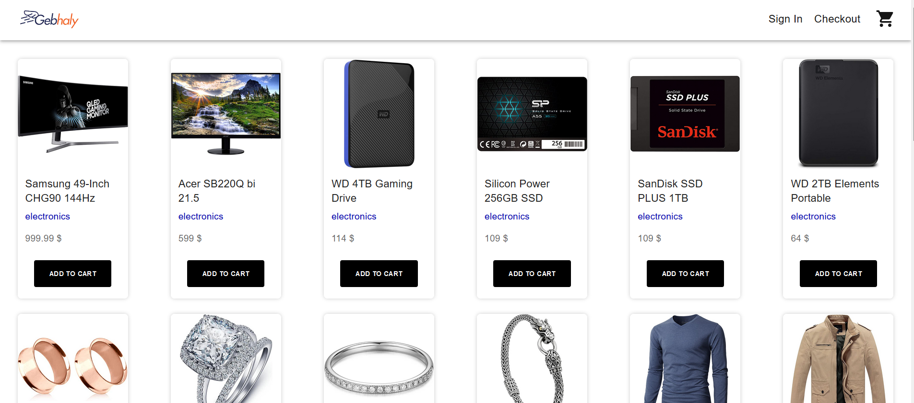
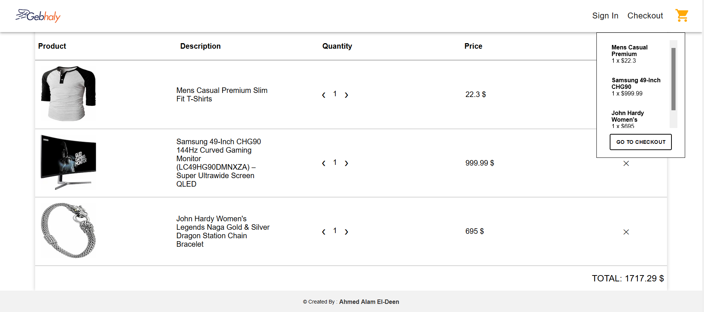

<div id="top"></div>


<div align="center">
  <a href="https://gebhaly-ahmedalam98.vercel.app" target="_blank">
    
  </a>
  <h1>Gebhaly.com</h1>
  <p align="center">
  <a href="https://gebhaly-ahmedalam98.vercel.app" target="_blank">View Demo</a>
    ·
    <a href="https://github.com/ahmedalam98/Gebhaly.com-task/issues">Report Bug</a>
  </p>
</div>

<details>
  <summary>Table of Contents</summary>
  <ol>
    <li>
      <a href="#about-the-project">About The Project</a>
    </li>
    <li><a href="#built-with">Built With</a></li>
    <li><a href="#getting-started">Getting Started</a></li>
  </ol>
</details>

## About The Project

Simple responsive E-commerce app that consumes dummy data from [fakestoreAPI](https://fakestoreapi.com/) with the following features :

- Product list (name, picture, category, price)
- Add items to cart
- Cart dropdown with the added cart items
- Checkout route :
  - view cart (items quantity, items cost, total cost)
  - edit cart (edit item quantity, remove item)
- Responsive design

## Built with

- Next.js
- TypeScript
- React
- Context API
- Sass
- Material UI

  
  

<p align="right">(<a href="#top">back to top</a>)</p>

## Getting Started

> To get a local copy up and running follow these simple steps :

1. Clone the repo
   ```sh
   git clone https://github.com/ahmedalam98/Gebhaly.com-task.git
   ```
2. Install dependencies
   ```sh
   npm install
   ```
3. Development mode
   ```sh
   npm run dev
   ```
4. Open `"http://localhost:3000"` with your browser to see the result.

<p align="right">(<a href="#top">back to top</a>)</p>
